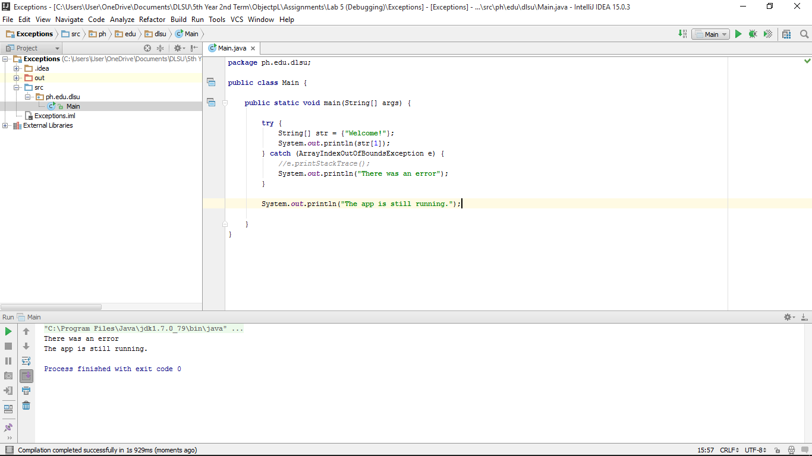

#Exceptions

Exceptions using try-catch

#ScreenSchot

#Code

~~~
package ph.edu.dlsu;

public class Main {

    public static void main(String[] args) {

        try {
            String[] str = {"Welcome!"};
            System.out.println(str[1]);
        } catch (ArrayIndexOutOfBoundsException e) {
            //e.printStackTrace();
            System.out.println("There was an error");
        }

        System.out.println("The app is still running.");

    }
}
~~~
